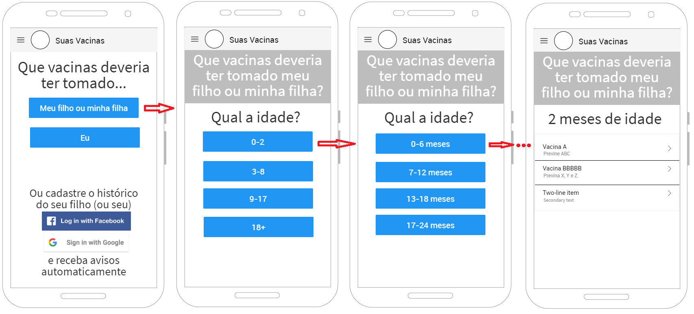

# Suas Vacinas

[](https://circleci.com/gh/suasvacinas/suasvacinas)

App de SuasVacinas.com.br

---

# Instruções/Histórico

Ambiente inicial (outros podem funcionar, apenas este foi o que usamos inicialmente):

- **Node v8.1.0** e **NPM 5.0.3**
  - Deve funcionar em Node 6.x e NPM 4.x.
- **Ionic Framework** e **para interagir com o firebase**
  - `npm i -g ionic cordova firebase-tools`


#### Como rodar o projeto:

```shell
# Subir o servidor/app
# Visite http://127.0.0.1:8100
ionic serve

# Testes unitarios
npm test

# Testes e2e
# Ligue a app:
ionic serve
# Enquanto a app estiver rodando:
npm run e2e
```

## Protótipo próxima versão



# Outros

Adicionei os arquivos de testes de unidade e e2e vide http://blog.ionic.io/basic-unit-testing-in-ionic/
 e https://github.com/driftyco/ionic-unit-testing-example.
Também foram feitas as adaptacoes necessarias, porque o CLI ionic ainda nao cria testes por padrao.
